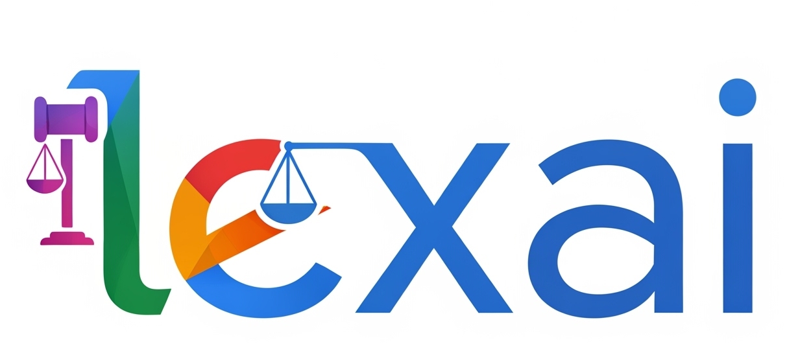
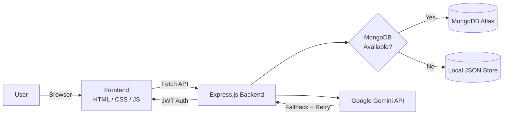

<div align="center">



# ⚖️ LexAI

### AI-Powered Legal Assistant Platform for Indian Law

*Understand Indian law, simulate courtrooms, and analyze contracts — all powered by Google Gemini AI.*

[](https://mylex-ai.vercel.app/)

[](https://nodejs.org/)
[](https://expressjs.com/)
[](https://www.mongodb.com/atlas)
[](https://ai.google.dev/)
[](https://mylex-ai.vercel.app/)
[](#-license)
[](#-contributing)
[](https://github.com/yoga0061/lexai-ai-lawyer/stargazers)
[](https://github.com/yoga0061/lexai-ai-lawyer/network/members)

<br/>


<br/><br/>

### 🔗 [**Try LexAI Live →**](https://mylex-ai.vercel.app/)

</div>

---

## 📑 Table of Contents

- [Live Demo](#-live-demo)
- [Overview](#-overview)
- [Features](#-features)
- [Technology Stack](#-technology-stack)
- [Project Structure](#-project-structure)
- [Environment Variables](#-environment-variables)
- [Local Installation](#-local-installation)
- [API Endpoints](#-api-endpoints)
- [Deploying to Vercel](#-deploying-to-vercel)
- [Troubleshooting](#-troubleshooting)
- [Security Features](#-security-features)
- [Supported Languages](#-supported-languages)
- [Roadmap](#-roadmap)
- [Contributing](#-contributing)
- [FAQ](#-faq)
- [License](#-license)
- [Developer](#-developer)

---

## 🌐 Live Demo

<div align="center">

### 🚀 The application is live and ready to use:

## 👉 **[https://mylex-ai.vercel.app/](https://mylex-ai.vercel.app/)** 👈

| Resource | Link |
|---|---|
| 🖥️ Live Application | [mylex-ai.vercel.app](https://mylex-ai.vercel.app/) |
| 💻 Source Code | [github.com/yoga0061/lexai-ai-lawyer](https://github.com/yoga0061/lexai-ai-lawyer) |
| 🐛 Report an Issue | [Open an Issue](https://github.com/yoga0061/lexai-ai-lawyer/issues) |

> 💡 **Tip:** No installation needed to try it out — just click the link above, register an account, and start exploring AI-powered legal consultations, the courtroom simulator, and document analysis instantly.

</div>

---

## 🧭 Overview

**LexAI v2** is a production-ready, AI-powered legal assistant designed to help users understand Indian laws through intelligent legal guidance. Built with **Google Gemini AI**, the platform provides legal consultation, courtroom simulations, contract analysis, multilingual support, and secure user authentication.

The application uses a **resilient architecture** that automatically falls back to local storage when MongoDB is unavailable, ensuring uninterrupted functionality during development and testing.



### 💡 Why LexAI?

| | Traditional Legal Research | **LexAI v2** |
|---|---|---|
| Availability | Office hours only | 🟢 24/7 instant access |
| Cost | Expensive consultations | 🟢 Free AI-powered guidance |
| Language | Usually English-only | 🟢 English, Hindi, Telugu, Kannada |
| Contract Review | Manual, time-consuming | 🟢 AI-analyzed in seconds |
| Case Preparation | Requires legal expertise | 🟢 Courtroom simulation for practice |

---

## 🚀 Features

<table>
<tr>
<td width="50%" valign="top">

### 📖 AI Legal Consultation
- Legal guidance grounded in Indian law
- AI-powered responses via Google Gemini
- Context-aware, multi-turn conversations
- Supports English, Hindi, Telugu, and Kannada

### ⚖️ Courtroom Simulator
- Simulates courtroom proceedings
- Generates petitioner & respondent arguments
- Produces witness statements and evidence
- Creates AI-generated judgments from facts

### 📄 Document Analyzer
- Upload legal agreements or contracts
- Detects risky clauses
- Identifies missing sections
- Highlights liabilities and legal concerns
- Generates AI-powered legal summaries

</td>
<td width="50%" valign="top">

### 👤 Secure Authentication
- JWT-based authentication
- User registration and login
- Protected API routes
- Secure password storage (hashed)
- Profile management

### 📚 Conversation History
- Stores previous legal consultations
- Saves courtroom simulations
- Saves analyzed legal documents
- Retrieve previous sessions anytime

### 🔄 Offline Database Fallback
- Auto-switches to local JSON storage if MongoDB is unavailable
- Zero interruption to the user experience
- Ideal for local dev/testing without a DB

</td>
</tr>
</table>

---

## 🛠 Technology Stack

| Layer | Technologies |
|---|---|
| **Frontend** | HTML5 · CSS3 · Vanilla JavaScript · Fetch API · Local Storage |
| **Backend** | Node.js · Express.js · MongoDB · Mongoose · JWT · Helmet · CORS · Morgan · Express Rate Limiter |
| **AI** | Google Gemini API · Automatic model fallback · Exponential backoff retry |
| **Deployment** | GitHub · Vercel · MongoDB Atlas |

---

## 📁 Project Structure

```text
lexai-ai-lawyer/
│
├── client/
│   └── public/
│       ├── favicon.ico
│       ├── logo.png
│       ├── logo2.png
│       ├── index.html
│       ├── style.css
│       └── src/
│           ├── script.js
│           ├── lang/
│           │   ├── en.json
│           │   ├── hi.json
│           │   ├── kn.json
│           │   └── te.json
│           └── utils/
│               └── api.js
│
├── server/
│   ├── config/
│   ├── middleware/
│   ├── models/
│   ├── routes/
│   ├── services/
│   ├── data/
│   ├── index.js
│   ├── package.json
│   └── package-lock.json
│
├── api/
│   └── index.js
│
├── .env.example
├── .gitignore
├── package.json
├── vercel.json
└── README.md
```

---

## 🔐 Environment Variables

Create a `.env` file inside the project root:

```env
GEMINI_API_KEY=your_gemini_api_key

MONGODB_URI=mongodb://127.0.0.1:27017/lexai-v2

JWT_SECRET=your_super_secure_secret

CLIENT_URL=http://localhost:3000
```

> ⚠️ **Never commit your `.env` file to GitHub.** Add it to `.gitignore` and share only `.env.example` with placeholder values.

---

## 💻 Local Installation

### Prerequisites

| Requirement | Version |
|---|---|
| Node.js | 18+ |
| npm | Latest |
| MongoDB | Optional (falls back to local JSON) |

### 1. Clone the Repository

```bash
git clone https://github.com/yoga0061/lexai-ai-lawyer.git
cd lexai-ai-lawyer
```

### 2. Install Dependencies

Backend:
```bash
npm install --prefix server
```

Frontend (if applicable):
```bash
npm install
```

### 3. Start the Development Server

```bash
npm run dev
```

### 4. Open in Browser

```
http://localhost:3000
```

---

## 📡 API Endpoints

### 🔑 Authentication

| Method | Endpoint | Description |
|---|---|---|
| `POST` | `/api/auth/register` | Register a new user |
| `POST` | `/api/auth/login` | Log in an existing user |
| `GET` | `/api/auth/me` | Get the current authenticated user |

### 🧠 AI Services

| Method | Endpoint | Description |
|---|---|---|
| `POST` | `/api/query` | Submit a legal query to the AI |
| `POST` | `/api/analyze-document` | Analyze an uploaded legal document |

### 📚 History

| Method | Endpoint | Description |
|---|---|---|
| `GET` | `/api/history/conversations` | List all saved conversations |
| `GET` | `/api/history/conversations/:id` | Get a specific conversation |
| `DELETE` | `/api/history/conversations/:id` | Delete a conversation |
| `GET` | `/api/history/courtroom` | List all courtroom sessions |
| `GET` | `/api/history/courtroom/:id` | Get a specific courtroom session |
| `GET` | `/api/history/documents` | List all analyzed documents |

---

## 🚀 Deploying to Vercel

### 1. Push Project to GitHub

```bash
git add .
git commit -m "Production Ready"
git push origin main
```

### 2. Import into Vercel

1. Log in to [Vercel](https://vercel.com/)
2. Click **New Project**
3. Import **lexai-ai-lawyer**
4. Vercel automatically detects `vercel.json`

### 3. Add Environment Variables

Add the following in the Vercel dashboard under **Settings → Environment Variables**:

```
GEMINI_API_KEY
MONGODB_URI
JWT_SECRET
CLIENT_URL
```

### 4. Deploy

Click **Deploy** — your application will be live on your Vercel domain. 🎉

---

## ❓ Troubleshooting

<details>
<summary><strong>Gemini Rate Limit</strong></summary>
<br/>
If the Gemini API quota is exceeded, LexAI automatically attempts fallback models. If all models reach their quota, wait a few minutes and try again.
</details>

<details>
<summary><strong>JWT Errors</strong></summary>
<br/>
Ensure the following environment variable exists and is set correctly:

```
JWT_SECRET
```
</details>

<details>
<summary><strong>Database Not Saving</strong></summary>
<br/>
When deployed on Vercel, local JSON storage is temporary (ephemeral filesystem). For production deployments, configure:

- MongoDB Atlas
- `MONGODB_URI`
</details>

---

## 🔒 Security Features

- ✅ JWT Authentication
- ✅ Password Hashing
- ✅ Helmet Security Headers
- ✅ Rate Limiting
- ✅ Input Validation
- ✅ CORS Protection
- ✅ Environment Variable Protection

---

## 🌐 Supported Languages

| Language | Code |
|---|---|
| 🇬🇧 English | `en` |
| 🇮🇳 Hindi | `hi` |
| 🇮🇳 Telugu | `te` |
| 🇮🇳 Kannada | `kn` |

---

## 📌 Roadmap

- [ ] 🎙️ Voice-based legal assistant
- [ ] 🔍 OCR for legal document scanning
- [ ] 📑 PDF report generation
- [ ] 📖 AI legal citation support
- [ ] 👨‍⚖️ Real-time lawyer consultation
- [ ] 🧾 Case recommendation system
- [ ] 📰 Legal news integration

---

## 🤝 Contributing

Contributions are welcome! To contribute:

1. Fork the repository
2. Create a feature branch (`git checkout -b feature/amazing-feature`)
3. Commit your changes (`git commit -m "Add amazing feature"`)
4. Push to the branch (`git push origin feature/amazing-feature`)
5. Open a Pull Request

Please open an issue first to discuss major changes.

---

## 💬 FAQ

<details>
<summary><strong>Is LexAI a substitute for a real lawyer?</strong></summary>
<br/>
No. LexAI provides AI-generated legal guidance and information for educational purposes. For binding legal advice or representation, always consult a licensed advocate.
</details>

<details>
<summary><strong>Is the live demo free to use?</strong></summary>
<br/>
Yes — visit <a href="https://mylex-ai.vercel.app/">mylex-ai.vercel.app</a>, register an account, and start using the AI consultation, courtroom simulator, and document analyzer right away.
</details>

<details>
<summary><strong>What happens to my uploaded documents?</strong></summary>
<br/>
Documents are processed to generate an AI analysis and, if enabled, stored in your conversation history (MongoDB Atlas or local fallback storage) so you can revisit them later.
</details>

<details>
<summary><strong>Can I self-host LexAI instead of using the live demo?</strong></summary>
<br/>
Yes — follow the <a href="#-local-installation">Local Installation</a> and <a href="#-deploying-to-vercel">Deploying to Vercel</a> sections to run your own instance.
</details>

---

## 📄 License

This project is licensed under the **MIT License**. See the [LICENSE](./LICENSE) file for details.

---

## 👨‍💻 Developer

<div align="center">

**Yoganandha Banavathu**

[](https://github.com/yoga0061)

### ⭐ If you found this project useful, consider giving it a Star on GitHub!

</div>
